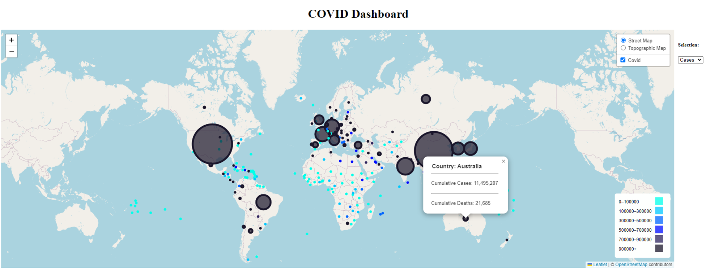
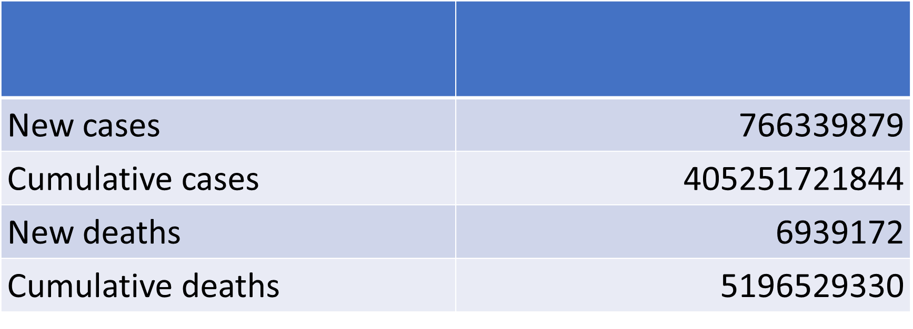
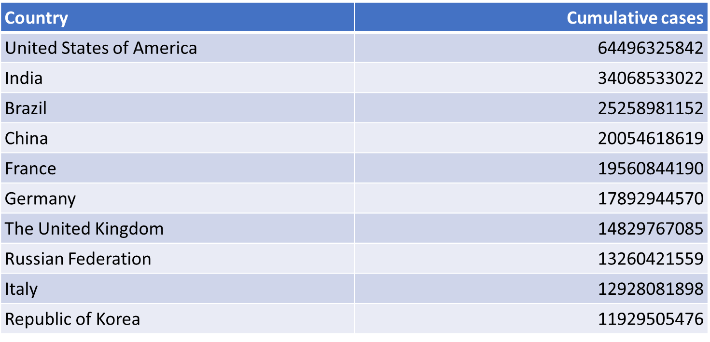

**Covid 19 Dashboard**

On March 11 2020 the World Health Organisation (WHO) declared the novel coronavirus (COVID-19) a worldwide pandemic. This pandemic declaration for COVID-19 is still active.

The project's primary goal is to analyse COVID-19  data and gain insights into the new and cumulative cases and deaths around the world. Which countries are hotspots for COVID-19 - identifying the top ten countries by cases and deaths.

Globally, as of 5:56pm CEST, 28 June 2023, there have been 767,518,723 confirmed cases of COVID-19, including 6,947,192 deaths, reported to WHO (source:WHO).

**This project was developed with the use of:**
Python
SQL
Flask
HTML
CSS
JavaScript

A global covid 19 dataset was downloaded from https://covid19.who.int/data, it includes data from 1 January 2020 to 28 June 2023
There was a total of 766339879 new cases, 405251721844 cumulative cases, new deaths 6 939 172 and 5196529330 Cumulative deaths. Due to the recent trend of countries conducting data reconciliation exercises which remove large numbers of cases or deaths from their total counts, such data may reflect as negative numbers in the new cases / new deaths counts as appropriate. WHO designed the dataset this way so that the user will be able to identify when such adjustments occur. 

**Implementation process:**

1). WHO-COVID-19-global-data.csv was read into Covid-19ETL.ipynb
  * Data cleaning was performed and unused columns dropped
  * Data was grouped by Country
  * Cleaned data was loaded into an SQL Database

2). app.py
    * a flask app was developed with the following endpoints:
    * / - landing page with rendered index html
    * /data - returns the Covid19 data into a json format
    *  SQL data was uploaded into flask and then returned in a GEOjson format

3). index.html - accesses all the libraries being used in the dashboard and displays the page contents

4). logic.js
    * leaflet to draw a map of the world and hold the cases and deaths data
    * hover over to identify the number of cases and deaths per country
    * drop down menu to select on either cases or deaths  - to then display the hover over on each country
    * plotly to develop a bar chart of new cases, cumulative cases, new deaths and cumulative deaths

5). style.css - applying style to the html page contents

**Dashboard:**

Top 10 countries by Cumulative Cases

**Conclusion:**

**Group members:**
Anuja 
Bec Ngooi
Rebecca Butcher
